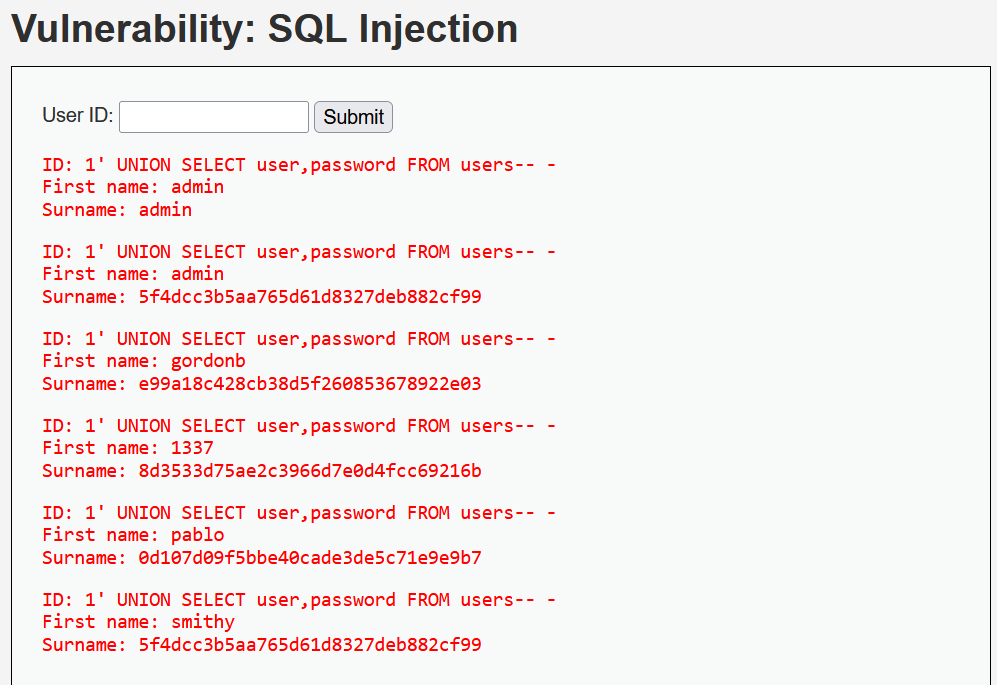
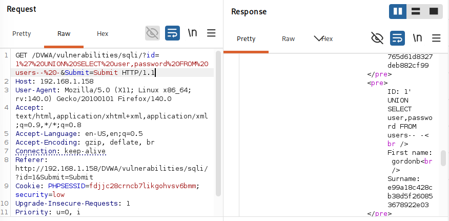

# SQL Injection (DVWA)

---

## 🇬🇧 English

### Description
SQL Injection allows attackers to retrieve and manipulate database data.

### Vulnerability Details
- Type: SQL Injection
- Severity: High
- Impact: Full database access

### Payload Used
' OR '1'='1

### Exploitation Steps
1. Intercepted request using Burp Suite
2. Modified parameter (id)
3. Injected SQL payload
4. Extracted user data
5. Used UNION SELECT to dump database

### Result
- Retrieved usernames
- Retrieved password hashes (MD5)

---

## 🇹🇷 Türkçe

### Açıklama
SQL Injection ile veritabanı verilerine erişim sağlandı.

### Zafiyet Detayları
- Tür: SQL Injection
- Seviye: Yüksek
- Etki: Tam veritabanı erişimi

### Kullanılan Payload
' OR '1'='1

### Yapılan Adımlar
1. Burp Suite ile request yakalandı
2. Parametre değiştirildi
3. SQL payload enjekte edildi
4. Kullanıcı verileri çekildi
5. UNION SELECT ile veritabanı dump alındı

### Sonuç
- Kullanıcı adları elde edildi
- MD5 hash'li şifreler elde edildi

---

## 📸 Evidence

### SQL Injection Result

### Database Dump

### Burp Suite Request

### Password Crack

⚠️ All tests are performed in a controlled lab environment (DVWA).
