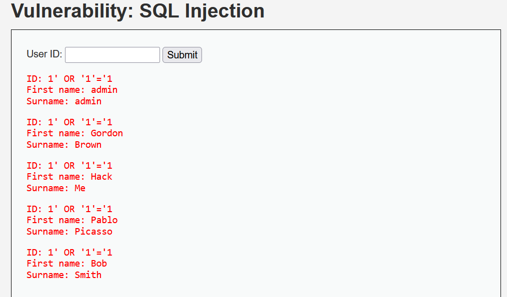
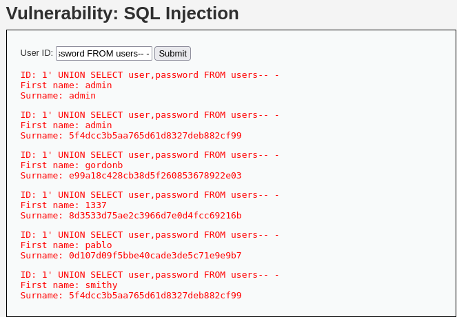
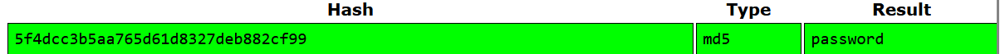

# SQL Injection (DVWA)

---

## 🇬🇧 English

### Description
SQL Injection is a critical web application vulnerability that allows attackers to manipulate SQL queries and gain unauthorized access to sensitive database data.

---

### Explanation
This vulnerability occurs when user input is directly incorporated into SQL queries without proper validation or sanitization.

As a result, attackers can modify the intended query logic, execute arbitrary SQL commands, and retrieve or manipulate sensitive data.

---

### Vulnerability Details
- Type: SQL Injection  
- Severity: High  
- Impact: Full database compromise  

---

### Payloads Used
- ' OR '1'='1'-- -
- ' UNION SELECT user, password FROM users-- -

---

### Exploitation Steps
1. Intercepted HTTP request using Burp Suite  
2. Identified vulnerable parameter (id)  
3. Injected test payload to confirm SQL Injection (' OR '1'='1')  
4. Verified vulnerability based on server response  
5. Performed UNION-based SQL Injection  
6. Extracted usernames and password hashes from the database  

---

### Result
- Successfully bypassed application logic  
- Retrieved multiple user records  
- Extracted password hashes  
- Demonstrated database-level data exposure  

---

### Password Cracking
Identified MD5 hashed passwords and successfully cracked them using common wordlists.

Example:  
5f4dcc3b5aa765d61d8327deb882cf99 → password

---

### Impact
An attacker can extract sensitive data such as usernames and passwords, bypass authentication mechanisms, and potentially gain full control over the database.

---

### Mitigation
- Use prepared statements (parameterized queries)  
- Implement proper input validation and sanitization  
- Apply least privilege principle for database access  

---

### Tools Used
- Burp Suite  
- DVWA (Damn Vulnerable Web Application)  
- Kali Linux  

- ## 📸 Proof of Exploitation

### SQL Injection Result (User Enumeration)

### Database Dump (Credentials Extraction)

### Burp Suite Request Manipulation

### Password Cracking

⚠️ All tests are performed in a controlled lab environment (DVWA).
---

## 🇹🇷 Türkçe

### Açıklama
SQL Injection, saldırganların SQL sorgularını manipüle ederek veritabanındaki hassas verilere yetkisiz erişim sağlamasına olanak tanıyan kritik bir web uygulaması zafiyetidir.

---

### Detay
Bu zafiyet, kullanıcıdan alınan verinin herhangi bir doğrulama veya filtreleme yapılmadan SQL sorgularına dahil edilmesinden kaynaklanır.

Bu sayede saldırganlar sorgu mantığını değiştirerek veritabanı üzerinde yetkisiz işlemler gerçekleştirebilir.

---

### Zafiyet Detayları
- Tür: SQL Injection  
- Seviye: Yüksek  
- Etki: Veritabanının tamamen ele geçirilmesi  

---

### Kullanılan Payloadlar
- ' OR '1'='1'-- -
- ' UNION SELECT user, password FROM users-- -

---

### İstismar Adımları
1. Burp Suite ile HTTP isteği yakalandı  
2. Zafiyetli parametre (id) tespit edildi  
3. Test payload (' OR '1'='1') enjekte edilerek zafiyet doğrulandı  
4. Sunucu yanıtı analiz edilerek SQL Injection doğrulandı  
5. UNION tabanlı SQL Injection gerçekleştirildi  
6. Veritabanından kullanıcı adı ve şifre hash'leri elde edildi  

---

### Sonuç
- Uygulama mantığı bypass edildi  
- Birden fazla kullanıcı verisi elde edildi  
- Şifre hash'leri çekildi  
- Veritabanı seviyesinde veri sızıntısı gösterildi  

---

### Şifre Kırma
MD5 ile hashlenmiş şifreler tespit edildi ve yaygın wordlist kullanılarak çözüldü.

Örnek:  
5f4dcc3b5aa765d61d8327deb882cf99 → password

---

### Etki
Saldırgan, kullanıcı adı ve şifre gibi hassas verileri ele geçirerek kimlik doğrulama mekanizmalarını aşabilir ve veritabanı üzerinde tam kontrol sağlayabilir.

---

### Önlem
- Prepared statement (parametreli sorgular) kullanımı  
- Girdi doğrulama ve filtreleme uygulanması  
- Veritabanı erişimlerinde minimum yetki prensibi  

---

### Kullanılan Araçlar
- Burp Suite  
- DVWA (Damn Vulnerable Web Application)  
- Kali Linux  

---

## 📸 Kanıtlar (İstismarın Kanıtı)

### SQL Injection Sonucu (Kullanıcı Listeleme)

### Veritabanı Dump (Kimlik Bilgileri Çekimi)

### Burp Suite İstek Manipülasyonu

### Şifre Kırma

---
  
⚠️ Tüm testler kontrollü bir lab ortamında (DVWA) gerçekleştirilmiştir.
