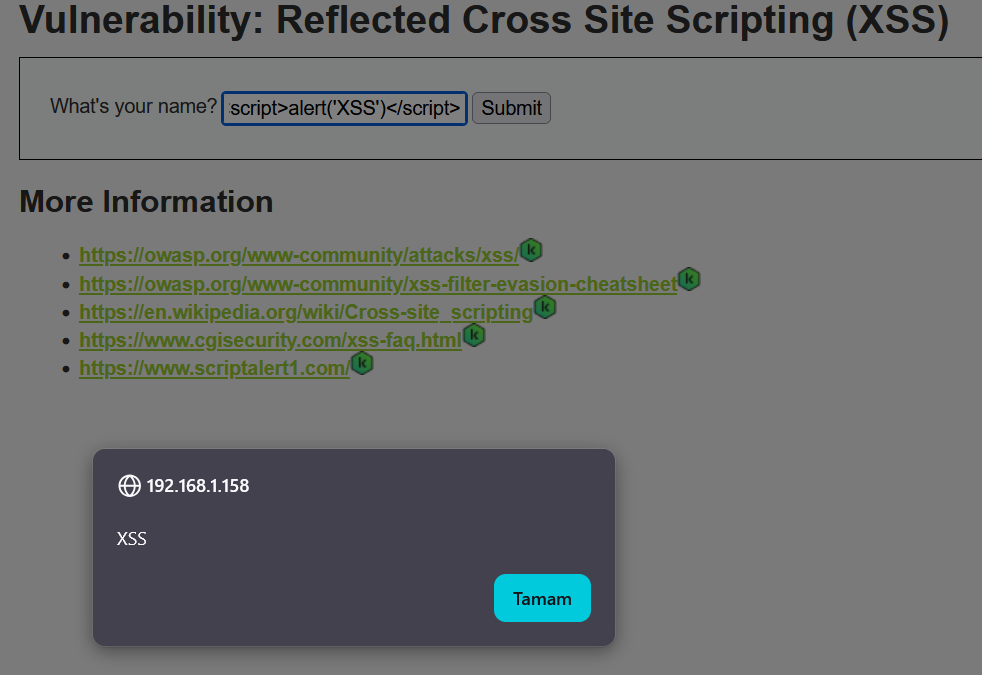
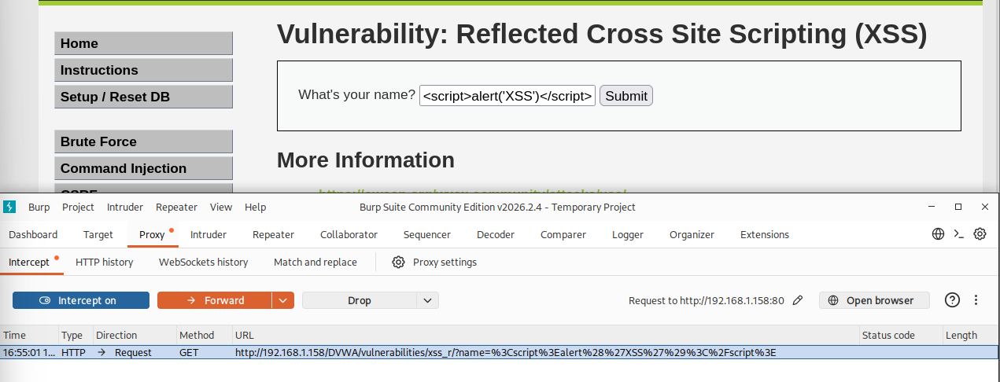

## 📸 Proof of Exploitation

### Impact

An attacker can execute malicious scripts in the victim's browser, steal session cookies, hijack user sessions, and perform actions on behalf of the user without their consent.

### XSS Payload Execution

### Burp Suite Request

---

## 📸 Kanıtlar (İstismarın Kanıtı)

### Etki

Saldırgan, kurbanın tarayıcısında zararlı script çalıştırabilir, oturum çerezlerini ele geçirebilir, kullanıcı oturumunu hijack edebilir ve kullanıcı adına işlem gerçekleştirebilir.

### XSS Payload Çalıştırma

### Burp Suite İsteği

